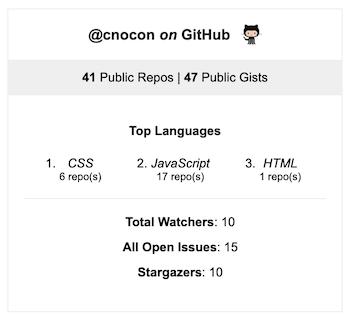

# Express GitHub Stats Card

Pass in a minimum of your [GitHub access token](https://docs.github.com/en/free-pro-team@latest/github/authenticating-to-github/creating-a-personal-access-token) and a [GitHub username](https://docs.github.com/en/free-pro-team@latest/github/setting-up-and-managing-your-github-user-account/remembering-your-github-username-or-email) and get this:



## Installation

```bash
npm install express-github-stats-card
```

## Example using Express:

The Card function returns an HTML string you can append anywhere. The first argument is the GitHub username, the second is your GitHub access token, and the third is an optional `Boolean` for whether or not you want to style the card with the included theme. Defaults to `false`.

Below is code for a `server.js` file you can use as a guide for setting up this component in your own Express application.

```js
// /server.js (command to run: node server.js)
const express = require('express');
const Card = require('./components/Card').Card;

const app = express();

app.get('/', async (req, res) => {
  // I used the dotenv npm package with a .env file containing GITHUB_ACCESS_TOKEN. 
  // THE .env file is in my .gitignore and will not show up here
  const statsCard = await Card('cnocon', process.env.GITHUB_ACCESS_TOKEN, true);
  res.send(statsCard);
});

app.listen(3000, () => {
	console.log('Server running on port 3000');
});
```
